<div align="center">
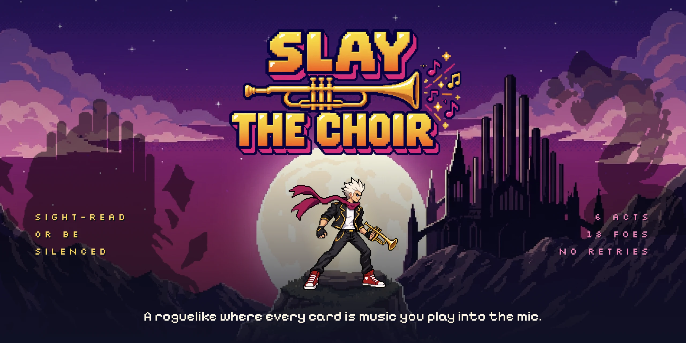
<br><br>
<a href="https://slaythechoir.club/"></a><a href="#">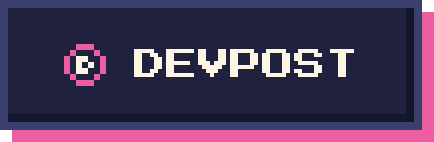</a><a href="#"></a><a href="https://app.paper.design/file/01M3DRNNWNJ9ZYFPFHF5YF6BJQ/p-2-0">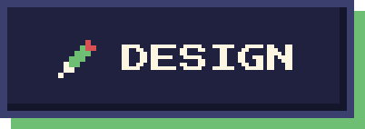</a>
</div>

---

<div align="center">
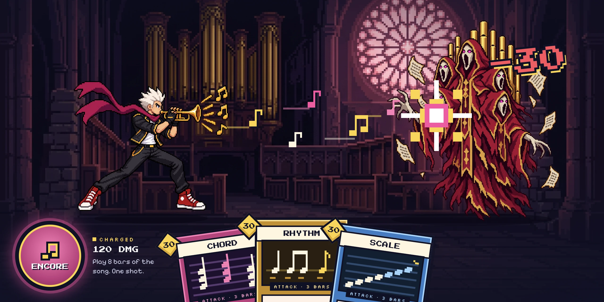
<p>
Slay the Choir is a Slay the Spire–style roguelike where <b>every card is a sight-reading exercise</b>.<br>
Play it on your real instrument into the mic. Hit the notes, the card lands. Miss them, the Choir sings back.
</p>
</div>

---

<table>
<tr>
<td width="58%">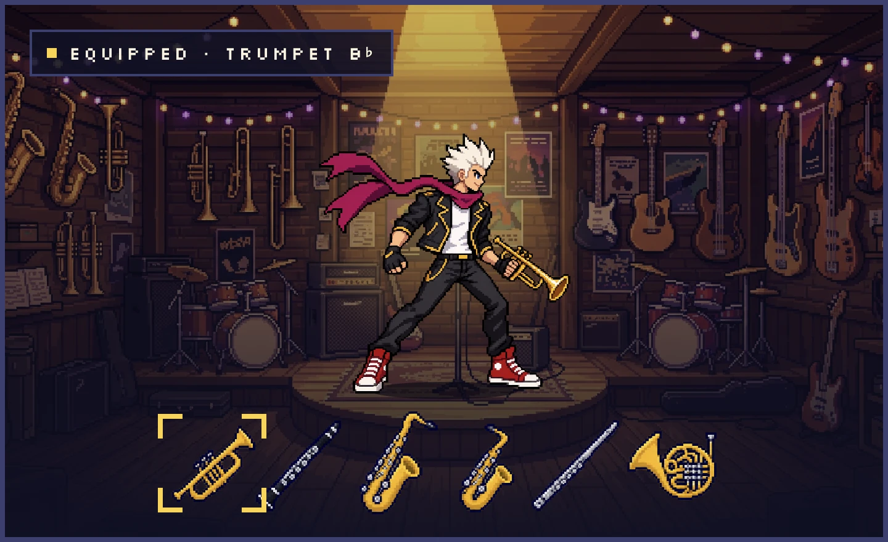</td>
<td width="42%">
<h3>Pick your instrument</h3>
Trumpet, clarinet, alto and tenor sax, flute or French horn. Every card is transposed to your instrument's written key.
</td>
</tr>
<tr>
<td width="42%">
<h3>Climb the spire</h3>
6 acts, 18 foes, no retries. Bosses taunt you out loud, and get meaner every time you miss.
</td>
<td width="58%">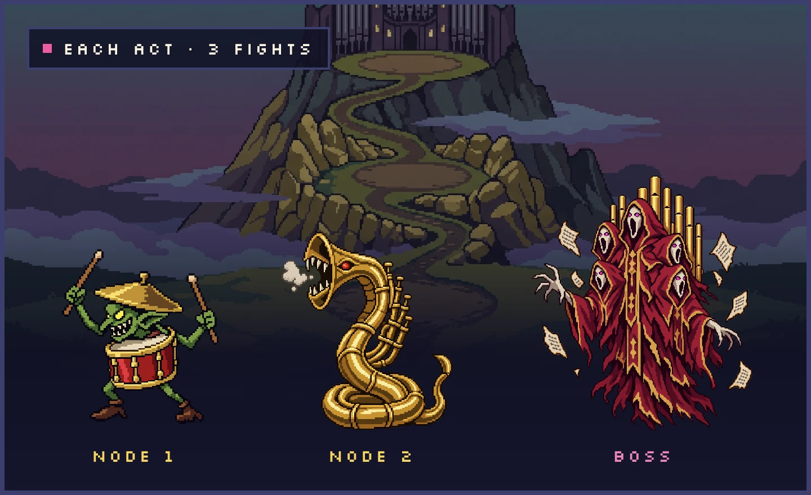</td>
</tr>
<tr>
<td width="58%">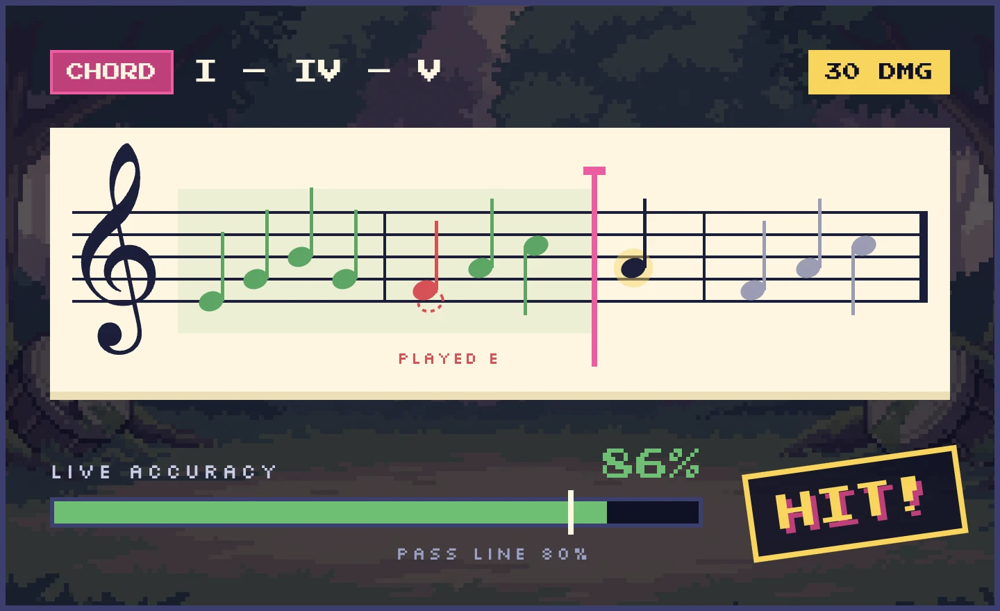</td>
<td width="42%">
<h3>Play to attack</h3>
Chords, rhythms and scales graded live, note by note. Clear 80% and the card hits.
</td>
</tr>
</table>

---

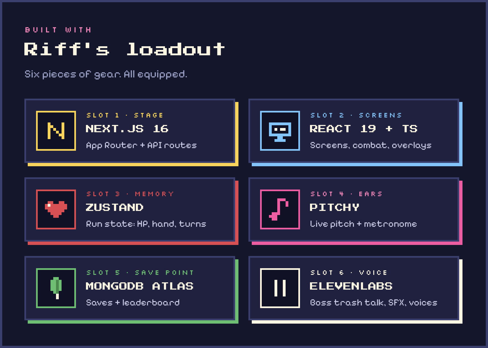

---

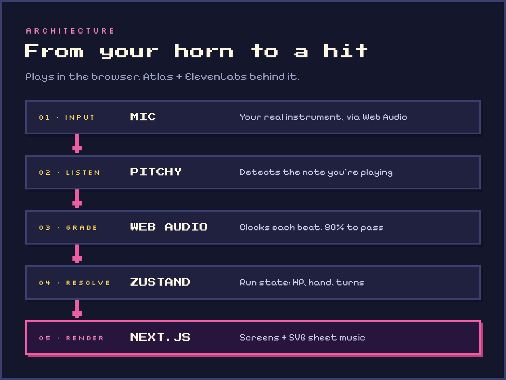

---

## &gt;_ Run it locally

```bash
git clone https://github.com/GridGxly/SlayTheChoir.git
cd SlayTheChoir
npm install
npm run dev
```

Add `ELEVENLABS_API_KEY` and `MONGODB_URI` to `.env.local` for trash talk and accounts. No mic? The game falls back to demo mode. No database? You play as a guest.

---

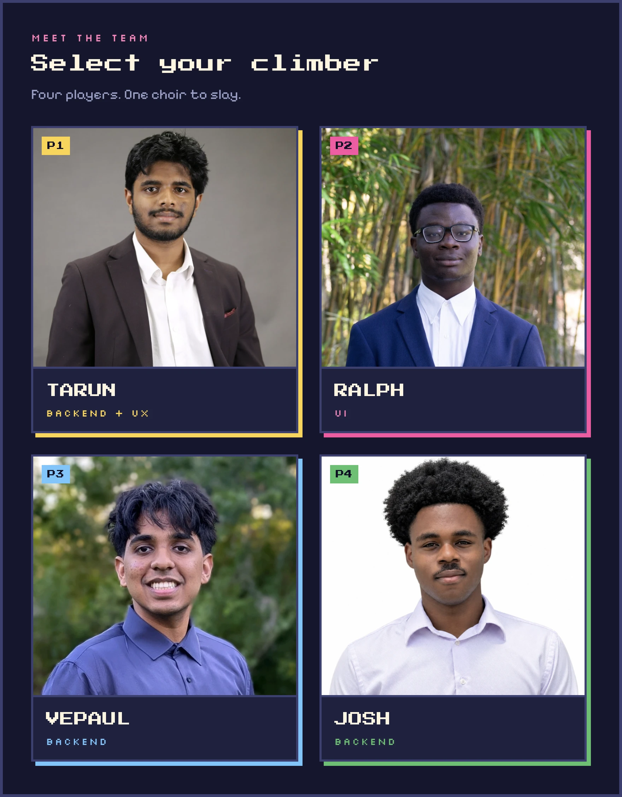

---

<div align="center">
<a href="https://github.com/GridGxly/SlayTheChoir">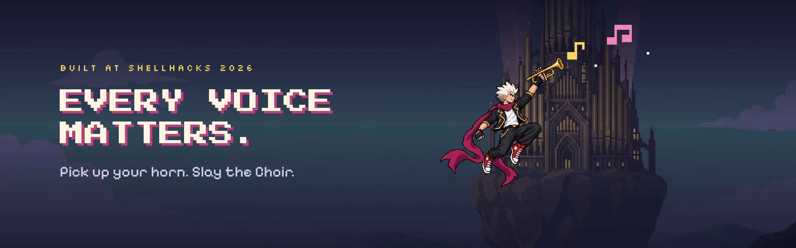</a>
</div>
